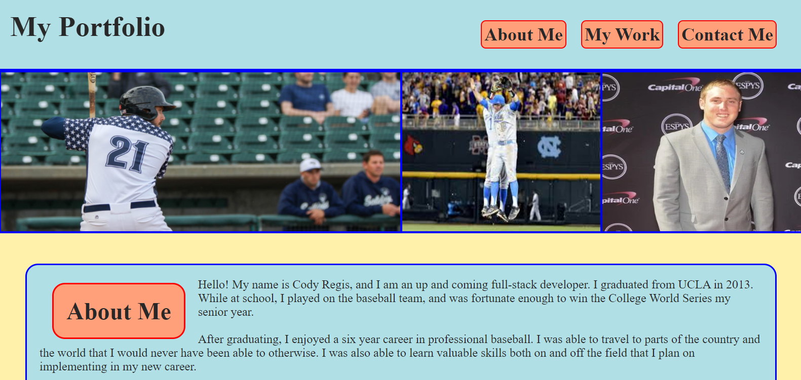

This is my proffesional portfolio page.  I created a header with a nav bar that links down the page to either one of my three main sections: "About Me", "My Work", and "Contact Me".

I implemented a light/retro color scheme throughout the entire page using CSS, and added button features to the nav bar, "My Work", and "Contact Me" sections.

I added a hero section below the header that includes a few pictures of me in my past profession.  I plan on updating with a professional photo of myself when I get one.

In my "About Me" section I included a brief introduction.

In my "My Work" section I added placeholders that I will replace with actual work for my portfolio as soon as I have work to put in there. 

In my "Contact Me' section I included links to my email, Linked-In page, and GitHub page.  These links all open in a new browser tab.

I added media queries to make the page look good regardless of the size of the browser/window screen.

Below is a screenshot of my portfolio page:

The link to my deployed application is below:
https://codyregis6891.github.io/my-portfolio/