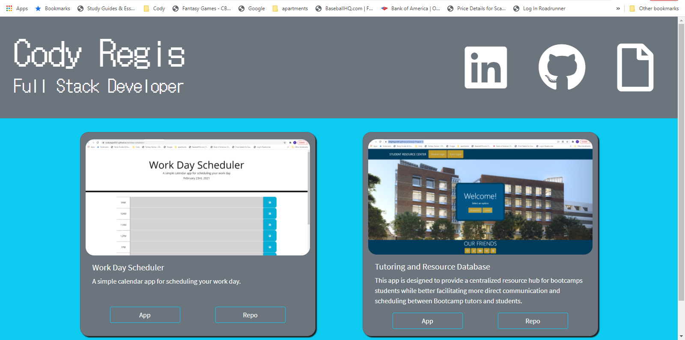

# My Portfolio

My portfolio contains HTML, CSS, and a few third party styling links, with plans of incorporating javaScript into it in the near future.

The cards in the body show previews of a few previous projects. More will be added in the near future.

The link to my deployed application is below along with a screenshot of my portfolio:
https://codyregis6891.github.io/my-portfolio/

## Questions?

* Reach out via email: codyregis6891@yahoo.com